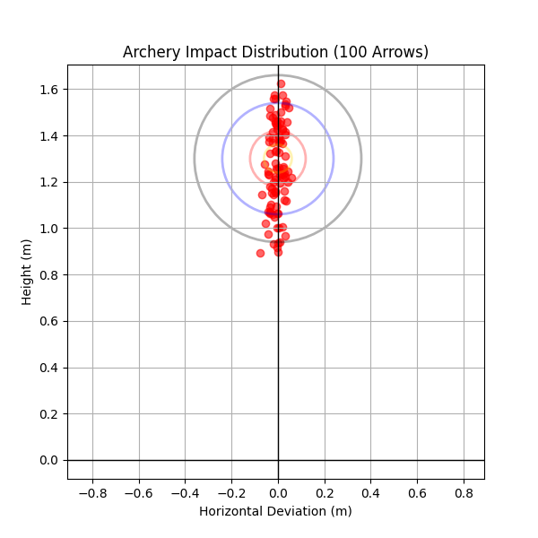
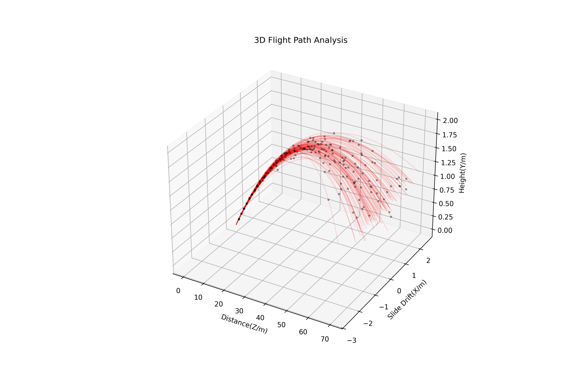

# Archery Ballistic Simulator

## Project Overview
This project is a Python-based simulation that models an arrow's flight from a 70-meter distance. I created this tool to analyze how gravity and wind affect shooting accuracy.

## 1. 2D Scoring & Impact Analysis (`archery_2D.py`)
First, I developed a 2D model to analyze the final results on the target. 
- **Scoring System**: The program automatically calculates scores based on the distance from the target center ($10, 9, 7, 5$ points).
- **Statistical Distribution**: By simulating 100 arrows, we can see the "spread" caused by wind and small errors in the launch angle.
- **Visualization**: The *red dots* show where the arrows hit, and the colored circles represent a standard archery target.

## 2. 3D Trajectory Modeling (`archery_3D.py`)
To understand *why* the arrows land there, I built a 3D physical model to show the full flight path.
- **Physics Engine**: I used the **Euler Method** to update the arrow's position and velocity every 0.01 seconds.
- **Environmental Factors**: The model accounts for air resistance ($k=0.02$) and gravity ($g=9.81$).
- **Monte Carlo Method**: I used `np.random.normal` to add random crosswind for each shot, which creates the realistic "bundle" of trajectories you see in the plot.
- **Waypoint Tracking**: The black dots on the paths show the arrow's movement and deceleration over time.

## Conclusion
This project helped me learn how to turn physics equations into a working Python program. It shows that even small environmental changes can lead to different scores in a professional 70m archery match.
